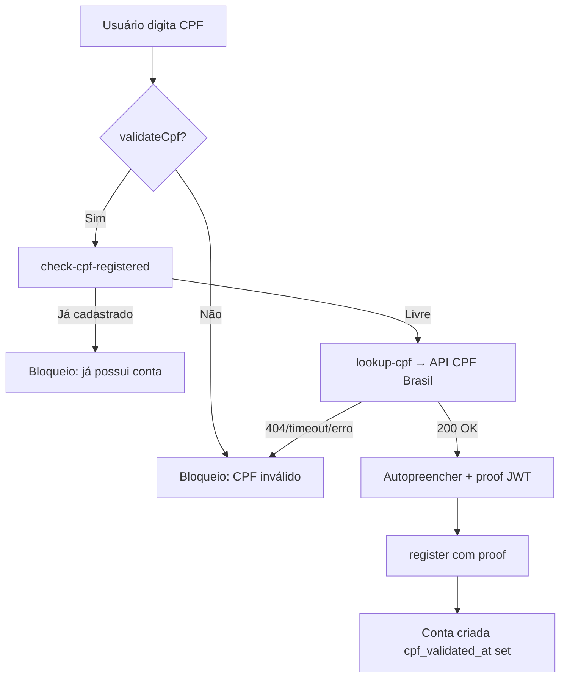
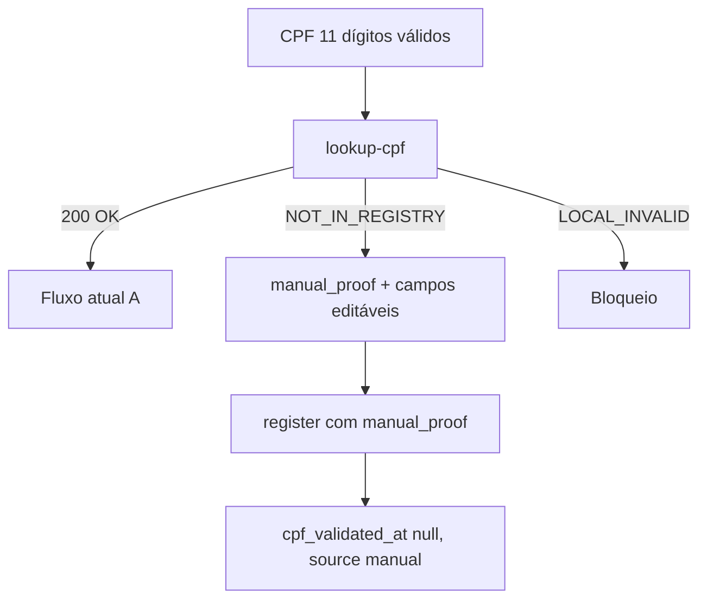

# AUDIT_CPF_API_FALLBACK_AND_MANUAL_VALIDATION

**Modo:** somente investigação (read-only)  
**Data:** 2026-06-05  
**Branch de referência:** `deploy-v1.0.2.7.9.45`

---

## Objetivo

Mapear o fluxo atual de validação e consulta de CPF antes de permitir:

- CPF encontrado na API → comportamento atual preservado
- CPF válido não encontrado → não bloquear; preenchimento manual
- CPF inválido → continuar bloqueando

---

## STATUS GERAL

| Dimensão | Situação atual |
|----------|----------------|
| Consulta API no cadastro público | **Ativa** (CPF Brasil) |
| Bloqueio quando API não encontra | **Sim** — mensagem unificada "CPF inválido" |
| Preenchimento manual no cadastro público | **Não** — exige `cpfLookupProof` JWT |
| Validação algorítmica (dígitos) | **Sim** — frontend + backend no lookup |
| Caminho manual organizador/admin | **Já existe** — sem API externa |
| Gap de validação | `createRunnerByOrganizer` aceita CPF só por tamanho (11 dígitos) |

---

## ETAPA 1 — Fluxos que usam consulta CPF

### Cadastro público (usa API CPF Brasil)

| Arquivo | Função / componente | Fluxo |
|---------|---------------------|-------|
| `src/pages/Auth.tsx` | Aba "Criar Conta" | Cadastro standalone |
| `src/components/MultiStepRegistration.tsx` | Dialog multi-step | Cadastro com referral/localStorage |
| `src/components/event/RegistrationFlow.tsx` | `handleRegister` | Inscrição → criar conta inline |
| `src/hooks/useCpfBrasilLookup.ts` | `runLookup` | Hook compartilhado (debounce 400ms) |
| `backend/src/controllers/cpfLookupController.ts` | `lookupCpfController` | `POST /api/auth/lookup-cpf` |
| `backend/src/services/cpfLookupService.ts` | `lookupCpfForRegistration` | Orquestração local + API |

**Fluxo resumido:**

```
CPF 11 dígitos → validateCpf (client)
  → POST /auth/check-cpf-registered
  → POST /auth/lookup-cpf
  → autopreenchimento + cpfLookupProof (JWT 15min)
  → POST /auth/register (com proof)
```

**Autopreenchimento:** nome, data de nascimento, sexo (bloqueado se API retornar M/F).  
**Pré-requisito MultiStep/Auth:** data de nascimento informada antes da consulta automática; conferência birth_date API × usuário.

### Cadastro pelo organizador / staff (NÃO usa API CPF Brasil)

| Arquivo | Função | Fluxo |
|---------|--------|-------|
| `src/components/registration/RegisterAthleteStaffDialog.tsx` | `handleCpfLookup` | Inscrição staff — busca DB |
| `backend/src/controllers/profilesController.ts` | `searchRunnerByCpfForOrganizerController` | `GET /profiles/organizer/search-by-cpf` |
| `backend/src/services/adminAthleteRegistrationService.ts` | `registerAthleteByStaff` | Cria inscrição + runner se necessário |
| `backend/src/services/registrationsService.ts` | `createRunnerByOrganizer` | Cria atleta quando CPF não existe |

**Comportamento:** CPF não encontrado na plataforma → formulário manual (nome, nascimento, cidade, sexo, etc.) — **já é o padrão desejado para cenário B**, mas só no fluxo staff.

### Líder de grupo — convites

| Arquivo | Função | Fluxo |
|---------|--------|-------|
| `src/components/runner/leader/LeaderDashboard.tsx` | `handleInviteCpfLookup` | `GET /profiles/public-by-cpf` |
| Mesmo componente | `handleSendInvitation` | Se atleta não encontrado → pré-cadastro manual |

### Admin — cadastro manual

| Arquivo | Função | Fluxo |
|---------|--------|-------|
| `src/components/admin/AdminManualRunnerCreate.tsx` | `submit` | `POST /admin/users/runners/manual` |
| `backend/src/services/userManagementService.ts` | `createManualRunner` | `isValidCpfDigits` — **sem API** |

### Login (CPF como identificador, sem API)

| Arquivo | Função | Fluxo |
|---------|--------|-------|
| `src/components/LoginDialog.tsx` | Login form | Email ou CPF mascarado |
| `src/pages/Auth.tsx` | Login tab | Idem |
| `backend/src/services/authService.ts` | `login` / `resolveLoginIdentifier` | Busca por CPF no DB |

---

## ETAPA 2 — Serviço da API de CPF

### Provider

| Item | Valor |
|------|-------|
| Cliente | `backend/src/services/cpfBrasilClient.ts` |
| Base URL | `CPF_BRASIL_API_BASE_URL` (ex.: `https://api.cpf-brasil.org`) |
| Autenticação | Header `X-API-Key: CPF_BRASIL_API_KEY` |
| Endpoint consulta | `GET {base}/cpf/{cpf}` |
| Health | `GET {base}/health` |
| Timeout | `CPF_BRASIL_TIMEOUT_MS` — default **10000ms**, máx. 60000 |
| Retries | **0** (uma única tentativa axios) |
| Feature flag | `CPF_BRASIL_ENABLED` (default `true`) |
| Proof obrigatório | `registerRequiresCpfLookupProof()` — true se URL+key configurados e enabled |

**Não há** ReceitaWS, BrasilAPI ou outro provider no código de produção — apenas **CPF Brasil API**.

### Respostas possíveis (mapeamento interno)

| HTTP / condição | `internalCode` | Mensagem ao usuário hoje |
|-----------------|----------------|--------------------------|
| 200 + NOME/NASC/SEXO | `OK` | Sucesso + autopreenchimento |
| 404 | `EXTERNAL_NOT_FOUND` | **"CPF inválido"** |
| Timeout | `EXTERNAL_TIMEOUT` | **"CPF inválido"** |
| Auth / quota / plano | `EXTERNAL_AUTH`, `EXTERNAL_QUOTA`, `EXTERNAL_PLAN` | **"CPF inválido"** |
| 200 sem campos | `EXTERNAL_BAD_RESPONSE` | **"CPF inválido"** |
| Config ausente | `CONFIG_MISSING` | **"CPF inválido"** |
| Feature off | `FEATURE_DISABLED` | **"CPF inválido"** |
| Dígitos inválidos (local) | `LOCAL_INVALID_FORMAT` | **"CPF inválido"** |
| Rate limit IP | `RATE_LIMITED` (429) | **"CPF inválido"** |

### Exemplos conceituais

**CPF encontrado (200):**

```json
{
  "success": true,
  "data": {
    "cpf": "12345678909",
    "full_name": "NOME DA PESSOA",
    "birth_date": "1990-01-15",
    "gender": "M",
    "gender_locked": true
  },
  "proof": "<JWT cpf_lookup_v1>",
  "meta": { "request_id": "...", "code": "OK" }
}
```

**CPF válido não encontrado (404):**

```json
{
  "success": false,
  "message": "CPF inválido",
  "code": "EXTERNAL_NOT_FOUND",
  "meta": { "request_id": "..." }
}
```

> **Problema central:** `EXTERNAL_NOT_FOUND` é indistinguível para o usuário de CPF com dígitos inválidos.

**Erro do provedor (timeout):**

```json
{
  "success": false,
  "message": "CPF inválido",
  "code": "EXTERNAL_TIMEOUT"
}
```

---

## ETAPA 3 — Pontos de bloqueio

| Arquivo | Linha (aprox.) | Camada | Tipo de bloqueio |
|---------|----------------|--------|------------------|
| `cpfLookupService.ts` | 52–64 | Backend service | `if (!api.ok)` → `success: false`, message "CPF inválido" |
| `cpfLookupController.ts` | 41–54 | Backend controller | HTTP 400 em falha |
| `useCpfBrasilLookup.ts` | 92–94 | Frontend hook | Sem proof → `lookupError`, `onInvalidate()` |
| `Auth.tsx` | 169–177 | Frontend | `canSubmitSignUp` exige `cpfLookupProof` |
| `MultiStepRegistration.tsx` | 314–316 | Frontend | `validateStep(1)` exige proof |
| `MultiStepRegistration.tsx` | 1171 | Frontend | Botão step 1 disabled sem proof |
| `RegistrationFlow.tsx` | 1025–1027 | Frontend | `handleRegister` retorna se !proof |
| `RegistrationFlow.tsx` | 2100 | Frontend | Botão disabled sem proof |
| `authService.ts` | 113–131 | Backend | `CPF_LOOKUP_PROOF_REQUIRED` / `INVALID` |
| `authController.ts` | 54–60 | Backend | Erros de proof → 400 |
| `rateLimiter.ts` | 114–123 | Middleware | 429 com message "CPF inválido" |

**Política documentada (v2.0):** `docs/PLANO_IMPLANTACAO_AUTH_CPF_BRASIL.md` define **bloqueio total** sem fallback manual — implementação atual segue essa política.

---

## ETAPA 4 — Auditoria da validação do CPF

### Algoritmo

Implementação **duplicada** (mesma lógica):

- Frontend: `src/lib/utils/validators.ts` → `validateCpf()`
- Backend: `backend/src/utils/cpf.ts` → `isValidCpfDigits()`

**Regras:**

1. Exatamente 11 dígitos
2. Rejeita `11111111111`, `00000000000`, etc. (`/^(\d)\1{10}$/`)
3. Validação módulo 11 dos dois dígitos verificadores

**Não usa** biblioteca externa (cpf-cnpj-validator, etc.).

### Matriz por camada

| Camada | Algoritmo | Observação |
|--------|-----------|------------|
| Frontend cadastro público | ✅ `validateCpf` | Antes de chamar API |
| Frontend organizador/líder | ✅ `validateCpf` | RegisterAthleteStaff, LeaderDashboard |
| Frontend admin manual | ⚠️ | Só required — **sem** `validateCpf` no client |
| Backend lookup/register | ✅ `isValidCpfDigits` | No lookup e manual runner |
| Backend organizer create | ❌ | Apenas `length === 11` |
| Backend profile update | ⚠️ | Apenas `length === 11` em `profilesService` |

### CPFs de teste

| CPF | `validateCpf` / `isValidCpfDigits` | `createRunnerByOrganizer` |
|-----|-------------------------------------|---------------------------|
| `11111111111` | ❌ Rejeitado | ⚠️ Passaria length check |
| `00000000000` | ❌ Rejeitado | ⚠️ Passaria length check |
| `12345678900` | ❌ Rejeitado (checksum) | ⚠️ Passaria length check |

---

## ETAPA 5 — Máscaras

**Utilitário:** `src/lib/utils/masks.ts`

- `maskCpf` → `000.000.000-00`
- `unmask` → só dígitos
- `maskEmailOrCpf` → login híbrido email/CPF

| Contexto | Máscara no input | Placeholder |
|----------|------------------|-------------|
| Cadastro público (Auth, MultiStep, RegistrationFlow) | ✅ `maskCpf` | `000.000.000-00` |
| Login | ✅ `maskEmailOrCpf` ou `maskCpf` (modo CPF-only) | email ou CPF |
| Organizador staff | ✅ | `000.000.000-00` |
| Líder convites | ✅ | `000.000.000-00` |
| Edição perfil | ✅ (readOnly se identity locked) | `000.000.000-00` |
| Cartão crédito (titular) | ✅ | `000.000.000-00` |
| Admin manual runner | ❌ texto livre | sem máscara no onChange |
| Listagens / PDF | Exibição `maskCpf` | — |

**Persistência:** sempre 11 dígitos no backend (`replace(/\D/g,'')`).

---

## ETAPA 6 — Dependências secundárias

| Área | Usa API CPF? | Usa CPF? | Notas |
|------|--------------|----------|-------|
| Login | Não | Sim | Identificador local |
| Recuperação senha | Não | Não | Email |
| Check-in / QR | Não | Indireto | Dados do perfil/inscrição |
| Certificados / rankings | Não | Não acoplado à API | |
| Exportações / relatórios | Não | `runner_cpf` mascarado | |
| Pagamentos Asaas | Não | `cpfCnpj` | Validação própria Asaas |
| `cpf_validated_at` | — | Metadado | Preenchido só no register com proof API |
| Dashboard admin | Não | Métricas | `GET /admin/reports/cpf-validation-overview` |

**Conclusão:** nenhuma integração downstream **depende do payload** da API CPF Brasil — apenas do CPF armazenado em `profiles.cpf` e opcionalmente `cpf_validated_at` / `cpf_lookup_source`.

---

## ETAPA 7 — Proposta de alteração (somente documento)

### Cenário A — CPF válido + encontrado na API

**Comportamento:** manter exatamente como hoje.

- `POST /auth/lookup-cpf` → 200 + data + `proof` (cpf_lookup_v1)
- Campos autopreenchidos; sexo bloqueado se M/F
- `POST /auth/register` com proof que casa nome/nascimento/gênero

### Cenário B — CPF válido + não encontrado

**Comportamento desejado:**

1. `lookupCpfForRegistration` retorna código distinto: ex. `CPF_NOT_IN_REGISTRY` (não `LOCAL_INVALID_FORMAT`)
2. Controller responde **200** com `{ manual_entry_allowed: true, cpf, proof: <manual_proof> }` **ou** 404 sem mensagem "inválido"
3. Hook `useCpfBrasilLookup` entra em modo manual — libera nome, nascimento, sexo editáveis
4. `authService.register` aceita `cpf_manual_v1` proof (só exige CPF válido + campos obrigatórios preenchidos)
5. `cpf_validated_at` = null, `cpf_lookup_source` = `'manual'` ou similar

**Mensagem UX sugerida:**  
*"CPF válido, mas não encontrado na base nacional. Preencha seus dados manualmente para continuar."*

### Cenário C — CPF inválido

**Comportamento:** bloquear.

- Manter `LOCAL_INVALID_FORMAT` → "CPF inválido. Verifique os dígitos."
- Sem proof, sem avanço

### Estratégia de implantação

| Fase | Escopo |
|------|--------|
| 1 | Backend: novos códigos + proof manual + flag `CPF_ALLOW_MANUAL_WHEN_NOT_FOUND` |
| 2 | Frontend: hook + Auth + MultiStep + RegistrationFlow |
| 3 | Hardening: `isValidCpfDigits` em `createRunnerByOrganizer`, `updateProfile`, admin form client |
| 4 | QA + métricas (`cpf_lookup_metrics` distinguir NOT_FOUND vs INVALID) |

**Feature flag sugerida:** `CPF_ALLOW_MANUAL_WHEN_NOT_FOUND=true` para rollout gradual em produção.

---

## ETAPA 8 — Riscos

| Área | Nível | Motivo |
|------|-------|--------|
| Cadastro público | **ALTO** | Mudança em proof, 3 UIs, authService |
| Cadastro organizador | **BAIXO** | Já manual; só reforçar validação |
| Edição de atleta | **MÉDIO** | Update profile sem algoritmo hoje |
| Inscrições antigas | **BAIXO** | Sem migração |
| Integrações | **BAIXO** | Sem dependência do retorno API |
| Pagamentos | **MÉDIO** | Asaas valida CPF independentemente |
| Ranking / certificados | **BAIXO** | |
| Fraude / identidade manual | **ALTO** | Exige rate limit, auditoria, possível revisão admin |

---

## Inventário de arquivos

Ver lista completa em `docs/audit-cpf-flow.json` → `files_inventory` (29 arquivos principais).

### Arquivos críticos para a mudança

```
backend/src/services/cpfLookupService.ts      ← distinguir NOT_FOUND
backend/src/services/cpfLookupProof.ts      ← proof manual
backend/src/controllers/cpfLookupController.ts
backend/src/services/authService.ts
src/hooks/useCpfBrasilLookup.ts
src/pages/Auth.tsx
src/components/MultiStepRegistration.tsx
src/components/event/RegistrationFlow.tsx
```

---

## Diagrama do fluxo atual (cadastro público)



## Diagrama proposto (cenário B)



---

## Entregáveis

| # | Arquivo | Status |
|---|---------|--------|
| 1 | `docs/audit-cpf-flow.md` | ✅ Este documento |
| 2 | `docs/audit-cpf-flow.json` | ✅ Snapshot estruturado |
| 3 | Inventário de arquivos | ✅ Seção + JSON |
| 4 | Lista de bloqueios | ✅ Etapa 3 |
| 5 | Estratégia de implantação | ✅ Etapa 7 |

**Nenhuma alteração de código foi aplicada nesta auditoria.**
