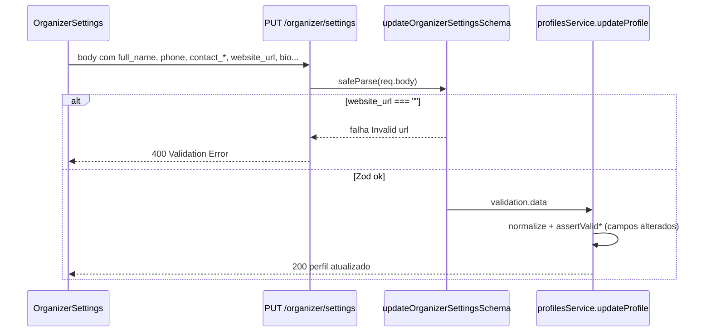
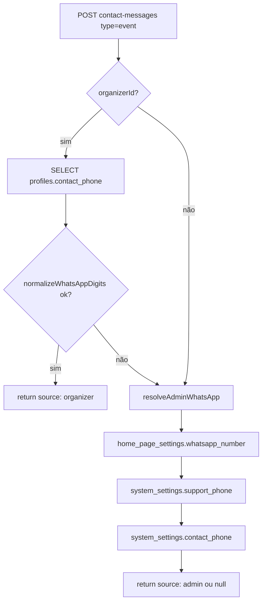

# AUDIT_ORGANIZER_SETTINGS_AND_CONTACT_WHATSAPP_ROUTING

**Modo:** READ ONLY  
**Data:** 2026-06-03  
**Auditoria executada em:** 2026-06-22  
**Objetivo:** investigar falhas na gravação das configurações do organizador e roteamento incorreto do WhatsApp no formulário “Entrar em Contato” dos eventos.

**JSON estruturado:** [`audit-organizer-settings.json`](./audit-organizer-settings.json)

---

## Resumo executivo

| Problema | Causa raiz | Severidade |
|----------|------------|------------|
| **“URL inválida” ao salvar** | `website_url: ""` enviado no PUT falha em `z.string().url().optional()` no backend | Crítica |
| **Campos em branco bloqueiam outros** | `handleSaveGeneral` envia **todos** os campos juntos; `website_url` vazio invalida a requisição inteira | Crítica |
| **WhatsApp abre número errado** | Resolução usa só `profiles.contact_phone`; se vazio/inválido → fallback admin (`home_page_settings.whatsapp_number`, etc.) | Alta |
| **Confusão telefone principal vs contato** | `profiles.phone` **não** entra na cadeia WhatsApp; só `contact_phone` | Alta |

**Nenhum código, migration ou banco foi alterado nesta auditoria.**

---

## ETAPA 1 — Tela de Configurações do Organizador

### Arquivos auditados

| Camada | Arquivo |
|--------|---------|
| UI | `src/components/organizer/OrganizerSettings.tsx` |
| API GET/PUT | `backend/src/controllers/organizerController.ts` |
| Persistência | `backend/src/services/profilesService.ts` |
| Normalização | `backend/src/utils/profileNormalization.ts` |
| Validação semântica | `backend/src/utils/profileValidation.ts` |

### Fluxo de salvamento



### Campos **não** presentes na UI (escopo solicitado vs realidade)

A auditoria pediu Instagram, Facebook, YouTube, Cidade e Estado. **Não existem** em `OrganizerSettings.tsx` nem na migration `012_organizer_settings.sql`. Cidade/estado existem em `profiles` para corredores, mas não nesta tela.

---

## ETAPA 2 — Inventário de campos (Organizer Settings)

| Campo na UI | API / DB | Obrigatório? | Validação | Vazio |
|-------------|----------|--------------|-----------|-------|
| Nome completo | `full_name` | Não na UI; Zod `min(1)` se enviado | `assertValidFullName` se mudou | `''` → **falha Zod** |
| Nome da organização | `organization_name` | Não | Nenhuma | Aceito |
| Telefone | `phone` | Não | `validatePhone` (FE) + `assertValidPhone` (BE) se mudou | `undefined` se vazio |
| E-mail de contato | `contact_email` | Não | e-mail semântico se mudou | `undefined` se vazio (FE) |
| **Telefone de contato** | `contact_phone` | Não | telefone semântico se mudou | `undefined` se vazio; **usado no WhatsApp** |
| Site | `website_url` | Não na UI | **`z.string().url()`** | `''` → **Invalid url** |
| Biografia | `bio` | Não | Nenhuma | Aceito |
| Logo | `logo_url` | Não | `z.string().url()`; upload separado | `null` na remoção; base64 `data:` passa |
| E-mail login | `users.email` | — | Somente leitura no GET | — |

### Trecho crítico — envio do frontend

```180:188:src/components/organizer/OrganizerSettings.tsx
      const response = await updateOrganizerSettings({
        full_name: fullName,
        phone: normalizedPhone || undefined,
        organization_name: organizationName,
        contact_email: normalizedContactEmail || undefined,
        contact_phone: normalizedContactPhone || undefined,
        bio: bio,
        website_url: websiteUrl,
      });
```

`website_url` é sempre enviado, inclusive como string vazia. Telefone/e-mail usam `|| undefined` — padrão correto que **falta no site**.

### Trecho crítico — schema Zod

```295:304:backend/src/controllers/organizerController.ts
const updateOrganizerSettingsSchema = z.object({
  full_name: z.string().min(1).optional(),
  phone: z.string().optional(),
  logo_url: z.string().url().nullable().optional(),
  organization_name: z.string().optional(),
  contact_email: z.string().email().optional(),
  contact_phone: z.string().optional(),
  bio: z.string().optional(),
  website_url: z.string().url().optional(),
});
```

Em Zod, `.optional()` permite **ausência** da chave ou `undefined`, **não** string vazia. Teste local: `safeParse({ website_url: '' })` → `{ success: false, message: 'Invalid url' }`.

---

## ETAPA 3 — Erro “URL inválida”

### Disparador principal

| Item | Valor |
|------|-------|
| Campo | `website_url` |
| Valor que falha | `""` |
| Mensagem Zod | `Invalid url` |
| Exibição | `apiClient` propaga `errorData.message` (400 Validation Error) |

### Outros disparadores possíveis

- `website_url: "www.site.com"` — sem `http://` ou `https://`
- `full_name: ""` — `min(1)` se a chave for enviada
- `contact_email: ""` — só se enviado explicitamente (frontend atual evita)

### O que **não** causa “URL inválida”

- `contact_phone`, `phone`, `bio`, `organization_name` — sem validação URL
- Upload de logo com `data:image/...;base64,...` — **passa** no Zod atual

### Padrão já usado no projeto (referência)

`homeBannersController.ts` aceita URL, string vazia ou null:

```typescript
z.union([z.string().url(), z.literal(''), z.null()]).optional()
```

---

## ETAPA 4 — Resolução do WhatsApp do organizador

### Serviço: `contactWhatsAppService.ts`



### Regras importantes

1. **Somente `profiles.contact_phone`** — `profiles.phone` é ignorado.
2. **`normalizeWhatsAppDigits`** retorna `null` se &lt; 10 dígitos após limpar máscara.
3. **Fallback admin** — ordem fixa; primeiro número válido vence.
4. **Default sem linha em `home_page_settings`** — `+5511999999999` (`homePageSettingsService.ts:18`).

### Resposta da API

```typescript
whatsapp: { phone: string; source: 'organizer' | 'admin' }
```

O `phone` já sai normalizado (ex.: `5585991084183`) para `wa.me`.

---

## ETAPA 5 — Cadeia “Entrar em Contato” (evento)

| # | Componente | Responsabilidade |
|---|------------|------------------|
| 1 | `EventDetails.tsx` | Abre `ContactDialog` com `eventId`, `organizer_contact_email` |
| 2 | `ContactDialog.tsx` | `createContactMessage({ type: 'event', event_id })` |
| 3 | `contactMessagesController` | `organizer_id = event.organizer_id`; persiste mensagem |
| 4 | `resolveWhatsAppForContactMessage` | Define `whatsapp.phone` e `whatsapp.source` |
| 5 | `ContactDialog` | `window.open(buildWhatsAppUrl(whatsappPhone, text))` |

- **Sem cache** de número no frontend.
- Página do evento **exibe** `organizer_contact_phone` (mesmo campo da resolução).
- Botão WhatsApp no **inbox** (`ContactMessageRowActions`) usa `message.phone` do **remetente**, não do organizador — fluxo distinto.

---

## ETAPA 6 — Banco de dados

A consulta read-only não foi concluída no ambiente da auditoria (timeout de conexão PostgreSQL). Use os SQL abaixo no evento/organizador em teste:

```sql
-- Organizadores recentes
SELECT p.id, p.full_name, p.phone, p.contact_phone, p.organization_name
FROM profiles p
JOIN user_roles ur ON ur.user_id = p.id AND ur.role = 'organizer'
ORDER BY p.updated_at DESC NULLS LAST
LIMIT 10;

-- WhatsApp admin (home)
SELECT whatsapp_number FROM home_page_settings ORDER BY created_at DESC LIMIT 1;

-- Telefones admin (system)
SELECT contact_phone, support_phone FROM system_settings ORDER BY created_at DESC LIMIT 1;

-- Evento específico
SELECT e.id, e.title, e.organizer_id, p.contact_phone, p.phone
FROM events e
JOIN profiles p ON p.id = e.organizer_id
WHERE e.id = '<UUID_DO_EVENTO>';
```

**Interpretação:**

| `contact_phone` | `phone` | WhatsApp do formulário |
|-----------------|---------|-------------------------|
| válido | qualquer | `source: organizer` |
| NULL/vazio | preenchido | `source: admin` (número da home/system) |
| inválido (&lt;10 dígitos) | qualquer | `source: admin` |

---

## ETAPA 7 — Matriz de prioridade

### Campos opcionais que bloqueiam o salvamento

| Campo | Bloqueia outros? | Motivo |
|-------|------------------|--------|
| `website_url` vazio | **Sim** | Enviado no PUT; Zod rejeita |
| `full_name` vazio | **Sim** | Enviado no PUT; Zod `min(1)` |

### Validações incorretas / desalinhadas

| Issue | Severidade | Arquivo |
|-------|------------|---------|
| `website_url` não trata `''` | Crítica | `organizerController.ts` |
| UX não diferencia telefone vs telefone de contato para WhatsApp | Alta | `OrganizerSettings.tsx` |
| Lista de campos sociais no escopo não implementada | Info | — |

### Origem do WhatsApp vs expectativa

| Cenário usuário | Número efetivo | `source` |
|-----------------|----------------|----------|
| Preencheu só “Telefone” | Admin fallback | `admin` |
| Preencheu “Telefone de Contato” | `profiles.contact_phone` | `organizer` |
| `contact_phone` vazio no DB | Primeiro válido em home → support → system contact | `admin` |

---

## ETAPA 8 — Compatibilidade

### Alterações seguras (plano de correção)

- Relaxar Zod de `website_url` (padrão `homeBannersController`).
- Frontend: `website_url: websiteUrl.trim() || undefined`.
- Texto de ajuda na UI sobre qual telefone vai para WhatsApp.

### Alterações que exigem cuidado

- Usar `profiles.phone` como fallback antes do admin — muda comportamento para quem hoje cai no número da plataforma de propósito.
- Reordenar candidatos admin — impacta contato “plataforma” e eventos sem `contact_phone`.

### Não quebrar

- E-mails de notificação (`new_contact_message_event` / `platform`)
- `contact_messages`, badges, evento `contact-messages-updated`
- Inbox admin e organizador
- Fallback admin quando organizador sem número
- Upload/remoção de logo

---

## Plano de correção seguro

### Fase 1 — Desbloquear salvamento (baixo risco)

1. **Backend:** `website_url` → `z.union([z.string().url(), z.literal('')]).optional()` com transform para `undefined` quando vazio.
2. **Frontend:** omitir `website_url` quando vazio; opcionalmente `full_name` só se `trim()`.
3. **UI:** helper em “Telefone de Contato”: *“Usado no WhatsApp do formulário Entrar em Contato dos seus eventos.”*

### Fase 2 — WhatsApp correto (médio risco)

**Opção A (recomendada):** em `resolveOrganizerWhatsApp`, tentar `contact_phone`, depois `phone`, depois admin.

**Opção B (mínima):** só documentação/UI — organizador deve preencher “Telefone de Contato”.

**Observabilidade:** log `[CONTACT_WHATSAPP] source= organizer|admin organizerId=...` (sem número em log se política de PII exigir).

### Fase 3 — Testes de regressão

- [ ] Salvar settings com Site vazio + `contact_phone` preenchido
- [ ] Salvar alterando só telefone com site vazio no formulário
- [ ] Contato em evento → `whatsapp.source === 'organizer'` quando `contact_phone` válido
- [ ] Contato em evento sem `contact_phone` → `source === 'admin'`
- [ ] Logo upload/remove
- [ ] E-mail ao organizador após mensagem de evento

---

## Conclusão

O erro **“URL inválida”** ao salvar configurações do organizador é causado quase certamente pelo campo **Site (`website_url`)** enviado como string vazia, rejeitado pelo schema Zod antes de qualquer outro campo ser persistido. Isso explica por que telefones e demais dados “não gravam” quando o site está em branco.

O WhatsApp incorreto no **Entrar em Contato** ocorre quando `profiles.contact_phone` está vazio ou inválido: o sistema usa o **fallback admin** (tipicamente `home_page_settings.whatsapp_number`), e não o telefone principal do perfil. O organizador precisa preencher explicitamente **Telefone de Contato** — ou o código deve ser estendido para considerar `profiles.phone` antes do fallback.
