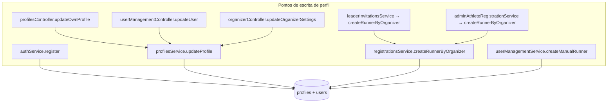

# AUDIT_PROFILE_DATA_NORMALIZATION_AND_INPUT_HARDENING

**Modo:** READ ONLY  
**Data:** 2026-06-03  
**Objetivo:** mapear pontos de entrada de dados de perfil e recomendar implantação segura de máscaras, normalização e validação — **sem alterar código, banco ou comportamento**.

**JSON estruturado:** [`audit-profile-normalization.json`](./audit-profile-normalization.json)

---

## Resumo executivo

O sistema possui **máscaras e validadores compartilhados** (`masks.ts`, `validators.ts`) usados de forma **heterogênea** entre fluxos. O backend aplica hardening forte em **CPF** (vários serviços), normalização parcial em **e-mail** (cadastro manual admin e update de perfil) e **quase nenhuma regra semântica** em nome, cidade, bairro ou telefone na camada de persistência.

**Principais gaps:**

| Gap | Severidade |
|-----|------------|
| `full_name` aceita dígitos, uma palavra, MAIÚSCULAS cruas | Alta |
| `createRunnerByOrganizer` permite `full_name` vazio após `trim` | Alta |
| `AdminManualRunnerCreate` — telefone sem máscara/validação | Alta |
| `authService.register` não normaliza e-mail (login usa `lower(trim)`) | Média |
| Cidade/bairro — só `min length 2`, números puros aceitos | Média |
| `birth_date` sem faixa 8–120 anos no cadastro | Média |
| Dados legados não devem ser revalidados na leitura | Compatibilidade |

**Estratégia recomendada:** normalizar e validar **somente em writes** (create/update), com utils compartilhadas backend + frontend; **não** alterar exibição/export de registros antigos.

---

## ETAPA 1 — Inventário de campos

### Tabela `profiles` (+ `users.email`)

| Campo DB | Aliases UI/API | Onde é coletado |
|----------|----------------|-----------------|
| `full_name` | `fullName`, `name` | Todos os cadastros e edições |
| `phone` | `phone` | Cadastro, perfil, staff, convites |
| `contact_phone` | `contact_phone`, `organizer_contact_phone` | OrganizerSettings, exibição evento |
| `users.email` | `email` | Cadastro, login, perfil |
| `postal_code` | `postalCode`, `zip_code` | MultiStepRegistration, ProfileEditDialog |
| `city` | `city` | MultiStep, staff, convites, perfil |
| `neighborhood` | `neighborhood`, `bairro` | MultiStep, perfil |
| `state` | `state` | MultiStep, perfil |
| `street` | `street`, `address` | MultiStep, perfil |
| `gender` | `gender` | Cadastros (M/F), categorias |
| `birth_date` | `birthDate`, `birth_date` | Cadastros, CPF lookup |
| `preferred_name` | `preferredName`, apelido | MultiStep, admin manual |

### Telefones fora de `profiles.phone`

| Campo | Tabela | Uso |
|-------|--------|-----|
| `whatsapp_number` | `home_page_settings` | Home, fallback WhatsApp |
| `contact_phone` | `system_settings` | Admin config |
| `support_phone` | `system_settings` | Admin config |

---

## ETAPA 2 — Inventário backend



### `authService.ts` — `register()`

| Aspecto | Situação atual |
|---------|----------------|
| **Arquivo** | `backend/src/services/authService.ts` ~L104–209 |
| **CPF** | Dígitos; proof CPF Brasil / manual |
| **E-mail** | Inserido **como recebido** (`data.email`) |
| **Telefone** | Inserido **como recebido** (frontend costuma enviar dígitos) |
| **Nome** | `data.full_name` sem trim/normalização |
| **Endereço** | Opcional, sem validação de formato |
| **Controller** | `authController.ts` — só checagem de presença + LGPD |

### `profilesService.ts` — `updateProfile()`

| Aspecto | Situação atual |
|---------|----------------|
| **Arquivo** | `backend/src/services/profilesService.ts` ~L65–111 |
| **CPF** | Strip não-dígitos + `isValidCpfDigits` |
| **Demais campos** | `UPDATE` direto, sem trim global |
| **Campos suportados** | `full_name`, `phone`, `gender`, `birth_date`, endereço, `contact_phone`, etc. |

### `registrationsService.ts` — `createRunnerByOrganizer()`

| Aspecto | Situação atual |
|---------|----------------|
| **Arquivo** | `backend/src/services/registrationsService.ts` ~L1386–1454 |
| **CPF** | Válido + único |
| **E-mail** | `toLowerCase()` se informado |
| **Nome** | `runner_data.full_name?.trim() \|\| ''` — **vazio permitido** |
| **Cidade/gênero/time/phone** | `trim` apenas |
| **Endereço** | Não preenchido neste INSERT |

### `userManagementService.ts` — `createManualRunner()`

| Aspecto | Situação atual |
|---------|----------------|
| **Arquivo** | `backend/src/services/userManagementService.ts` ~L757–845 |
| **E-mail** | `trim().toLowerCase()` |
| **CPF** | `normalizeCpfDigits` + `isValidCpfDigits` |
| **Nome** | `data.full_name.trim()` |
| **Telefone** | `data.phone.trim()` — **pode manter máscara** |
| **Endereço** | `trim` em cada campo opcional |
| **Schema Zod** | `createManualRunnerSchema` — min length, sem regras semânticas |

### `adminAthleteRegistrationService.ts` — `registerAthleteByStaff()`

Delega criação de runner para `createRunnerByOrganizer`; valida CPF e janela de inscrição.

### `leaderInvitationsService.ts`

Pré-cadastro via `createRunnerByOrganizer`; exige `full_name.trim()` no fluxo de convite quando CPF não encontrado (~L259).

### `organizerController.ts`

`updateOrganizerSettingsSchema`: `full_name` min 1, `contact_email` email, `contact_phone` string opcional **sem formato**.

### Controllers — resumo de validação

| Controller | Trim | Normalização | Zod / regras |
|------------|------|--------------|--------------|
| `authController` | Não | Não | Presença campos |
| `profilesController` | E-mail sim | E-mail lower | Regex e-mail; identidade bloqueada para runner |
| `userManagementController` | Parcial | E-mail lower (manual) | Zod min lengths |
| `organizerController` | Via service | Não | Zod básico |

---

## ETAPA 3 — Inventário frontend

### Máscaras existentes (`src/lib/utils/masks.ts`)

| Função | Formato |
|--------|---------|
| `maskCpf` | `000.000.000-00` |
| `maskPhone` | `(00) 00000-0000` / fixo 10 dígitos |
| `maskCep` | `00000-000` |
| `maskCreditCard` | `0000 0000...` |
| `unmask` | Remove não-dígitos |

### Validadores (`src/lib/utils/validators.ts`)

| Função | Regra |
|--------|-------|
| `validateCpf` | Algoritmo + 11 dígitos |
| `validatePhone` | 10 ou 11 dígitos |
| `validateCep` | 8 dígitos |
| `validateEmail` | Regex simples |
| `validateAgeRequirement` | Idade vs categoria (leitura) |
| `validateGenderRequirement` | M/F vs categoria |

**Não existem:** `validateFullName`, `validateCity`, normalização Title Case.

### Matriz por superfície

| Superfície | Arquivo | Máscaras | Validação nome | Validação cidade/bairro | E-mail |
|------------|---------|----------|----------------|-------------------------|--------|
| Cadastro Auth | `Auth.tsx` | CPF, phone | Só `Boolean(fullName)` | N/A | Sem lower |
| Multi-step | `MultiStepRegistration.tsx` | CPF, phone, CEP | min 3 chars | min 2 chars | lower onChange |
| Inscrição evento | `RegistrationFlow.tsx` | CPF, phone | required | N/A no cadastro curto | Sem lower garantido |
| Staff organizador | `RegisterAthleteStaffDialog.tsx` | CPF, phone opt | trim required | livre | opcional |
| Admin manual | `AdminManualRunnerCreate.tsx` | **CPF only** | trim required | opcional livre | required |
| Perfil atleta | `ProfileEditDialog.tsx` | CPF, phone, CEP | admin-only edit | livre | lower on save |
| Admin usuário | `UserProfileDialog.tsx` | **nenhuma** | livre | livre | trim only |
| Organizador | `OrganizerSettings.tsx` | **nenhuma** | N/A | N/A | email type |
| Líder convites | `LeaderDashboard.tsx` | CPF, phone opt | trim required | livre | opcional |
| Cartão | `CreditCardForm.tsx` | phone, cep, cpf | N/A | N/A | holder email |

---

## ETAPA 4 — Auditoria de problemas reais (análise estática)

Com base nas regras atuais de código, **é possível persistir**:

| Entrada problemática | Aceito hoje? | Onde |
|---------------------|--------------|------|
| Nome `11999999999` | **Sim** | Maioria dos fluxos |
| Nome `123456` / `0000` | **Sim** | idem |
| Nome `JOAO123` | **Sim** | idem |
| Nome `JOAO 11999999999` | **Sim** | idem |
| Nome uma palavra `João` | **Sim** | min 3 chars em MultiStep; Auth só truthy |
| Cidade `123456` | **Sim** | MultiStep min 2 |
| Bairro `99999999` | **Sim** | MultiStep min 2 |
| E-mail ` JOAO@GMAIL.COM` | **Parcial** | MultiStep/Profile lower; Auth/RegistrationFlow podem gravar maiúsculo |
| CEP no campo telefone | **Possível** | Máscara limita formato mas não valida semântica cruzada |
| Telefone no CEP | **Possível** | idem |
| Tudo MAIÚSCULO | **Sim** | Sem normalização de casing |

---

## ETAPA 5 — Classificação por risco

| Campo | Risco | Impacto |
|-------|-------|---------|
| Nome (`full_name`) | **ALTO** | Certificados, rankings, PDFs, export CSV, check-in |
| E-mail | **ALTO** | Login, notificações, Asaas |
| Data nascimento | **ALTO** | Idade, categoria, desconto sênior |
| Telefone | **MÉDIO** | WhatsApp, contato, pagamento |
| Sexo | **MÉDIO** | Categorias por gênero |
| CPF | **ALTO** | Identidade (já hardened) |
| CEP | **BAIXO** | Endereço, ViaCEP |
| Cidade | **BAIXO** | Relatórios, filtros |
| Bairro | **BAIXO** | Endereço |
| Endereço | **BAIXO** | Logística |
| `contact_phone` / WhatsApp site | **MÉDIO** | Contato organizador/plataforma |

---

## ETAPA 6 — Regras sugeridas (documento apenas)

### Nome

- Permitir: letras, espaços, acentos, hífen, apóstrofo  
- Exigir: mínimo **duas palavras** (exceto política explícita para apelido)  
- Bloquear: dígitos, CPF embutido, sequências só numéricas  
- Normalizar: Title Case inteligente (`JOAO DA SILVA` → `João da Silva`; partículas `da`, `de` minúsculas)

### E-mail

- `trim()` + `toLowerCase()` em **todo** write path  
- Unicidade case-insensitive (login já usa `lower(trim)`)

### Telefone

- Persistir: **somente dígitos** (10–11 BR)  
- UI: `maskPhone` + `validatePhone`

### CEP

- UI: `maskCep`  
- Persistência: 8 dígitos  
- `validateCep` no submit

### Cidade / Bairro

- Bloquear strings **somente numéricas**  
- Normalizar Title Case  
- min 2 caracteres alfabéticos efetivos

### Endereço (`street`)

- Permitir números  
- Normalizar casing de logradouro

### Sexo

- Enum fixo: `M` | `F` | `O` (alinhar frontend/backend)

### Data de nascimento

- Faixa: **8 a 120 anos** no cadastro  
- Manter `validateAgeRequirement` para categoria

---

## ETAPA 7 — Onde implantar

### Frontend (UX imediata)

| Prioridade | Superfície | Ação |
|------------|------------|------|
| P0 | `AdminManualRunnerCreate` | `maskPhone` + `validatePhone` |
| P0 | `UserProfileDialog` | máscaras phone/cep |
| P1 | Todos os `full_name` | bloqueio dígitos on input + hint "nome completo" |
| P1 | `OrganizerSettings` | máscara `contact_phone` |
| P2 | `Auth.tsx`, `RegistrationFlow` | email lower onChange |

### Backend (validação final obrigatória)

Ponto único recomendado: **`profileNormalization.ts`** chamado por:

- `authService.register`
- `profilesService.updateProfile`
- `createRunnerByOrganizer`
- `createManualRunner`
- `profilesController` / `userManagementController` (antes do service)

### Utils propostas

```
backend/src/utils/profileNormalization.ts
src/lib/utils/profileNormalization.ts
```

Funções candidatas:

| Função | Uso |
|--------|-----|
| `normalizeEmail(value)` | trim + lower |
| `normalizePhoneDigits(value)` | unmask + length check |
| `normalizePostalCode(value)` | 8 dígitos |
| `normalizePersonName(value)` | title case + trim |
| `normalizePlaceName(value)` | city/neighborhood |
| `validateFullName(value)` | 2+ palavras, sem dígitos |
| `validateBirthDateRange(value, minAge, maxAge)` | 8–120 |

---

## ETAPA 8 — Compatibilidade

Futuras validações **NÃO devem**:

- Rejeitar leitura de inscrições antigas  
- Alterar dados em export CSV/PDF retroativamente  
- Quebrar rankings que já exibem `runner_name` como gravado  
- Revalidar check-in para registros históricos  
- Alterar payloads já enviados ao Asaas  

**Padrão seguro:** validar/normalizar apenas em **CREATE** e **UPDATE**; opcional script admin de higienização em lote com opt-in.

---

## ETAPA 9 — Estratégia em sprints

| Sprint | Foco | Escopo |
|--------|------|--------|
| **1** | Normalização automática (soft) | E-mail lower, phone digits, trim global no backend |
| **2** | Nome completo obrigatório | 2+ palavras; corrigir `createRunnerByOrganizer` vazio |
| **3** | Bloqueio números no nome | Regex frontend + backend |
| **4** | Cidade, bairro, CEP | Bloqueio numérico puro; máscaras admin |
| **5** | Hardening completo | birth_date 8–120; gender enum; `contact_phone`; utils compartilhadas |

---

## Pontos frágeis (top 10)

1. `createRunnerByOrganizer` — `full_name` pode ser `''`  
2. `AdminManualRunnerCreate` — telefone sem máscara/validação  
3. `authService.register` — e-mail sem normalização  
4. `profilesService.updateProfile` — pass-through de strings cruas  
5. `UserProfileDialog` — sem máscaras  
6. `MultiStepRegistration` — nome min 3, não min 2 palavras  
7. Cidade/bairro — aceita `"12"`  
8. Telefone mascarado pode ir ao banco em `createManualRunner`  
9. `OrganizerSettings.contact_phone` — texto livre usado em WhatsApp  
10. Dados legados — qualquer validação na leitura quebraria relatórios

---

## Inventário completo de arquivos

### Frontend

- `src/pages/Auth.tsx`
- `src/components/MultiStepRegistration.tsx`
- `src/components/event/RegistrationFlow.tsx`
- `src/components/registration/RegisterAthleteStaffDialog.tsx`
- `src/components/admin/AdminManualRunnerCreate.tsx`
- `src/components/admin/UserProfileDialog.tsx`
- `src/components/runner/profile/ProfileEditDialog.tsx`
- `src/components/runner/leader/LeaderDashboard.tsx`
- `src/components/organizer/OrganizerSettings.tsx`
- `src/components/admin/SystemSettings.tsx`
- `src/components/payment/CreditCardForm.tsx`
- `src/lib/utils/masks.ts`
- `src/lib/utils/validators.ts`

### Backend

- `backend/src/services/authService.ts`
- `backend/src/services/profilesService.ts`
- `backend/src/services/registrationsService.ts`
- `backend/src/services/userManagementService.ts`
- `backend/src/services/adminAthleteRegistrationService.ts`
- `backend/src/services/leaderInvitationsService.ts`
- `backend/src/controllers/authController.ts`
- `backend/src/controllers/profilesController.ts`
- `backend/src/controllers/userManagementController.ts`
- `backend/src/controllers/organizerController.ts`

### Banco (referência)

- `backend/migrations/001_initial_schema.sql` — `profiles`, `users`
- `backend/migrations/029_add_address_fields_to_profiles.sql`
- `backend/migrations/012_organizer_settings.sql` — `contact_phone`, `contact_email`

---

## Recomendação de arquitetura

1. **Camada única de normalização no backend** em todos os writes — frontend melhora UX mas não é fonte da verdade.  
2. **Duplicar helpers no frontend** apenas para máscaras e feedback imediato.  
3. **Não migrar dados antigos** na primeira fase; validar só entradas novas.  
4. **Corrigir primeiro** `createRunnerByOrganizer` e `AdminManualRunnerCreate` (maior volume de dados ruins via staff).  
5. **Alinhar e-mail** em `authService.register` com login case-insensitive.  
6. **Documentar** para organizadores que `contact_phone` deve ser WhatsApp com DDD.

---

*Auditoria read-only. Nenhum código, migration ou comportamento foi alterado.*
