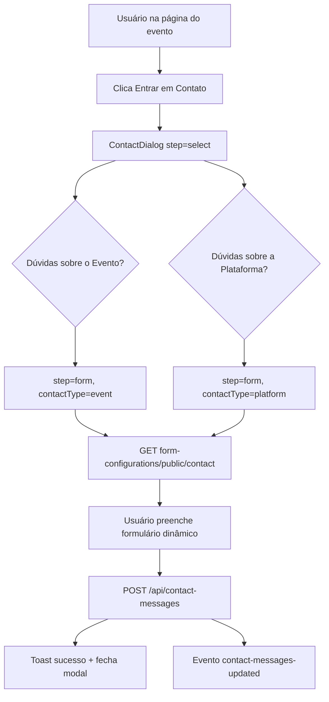
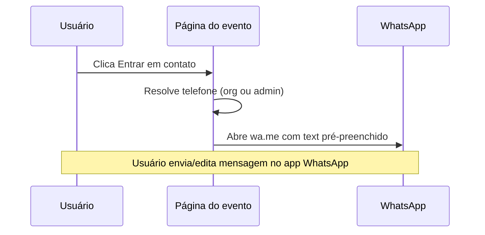
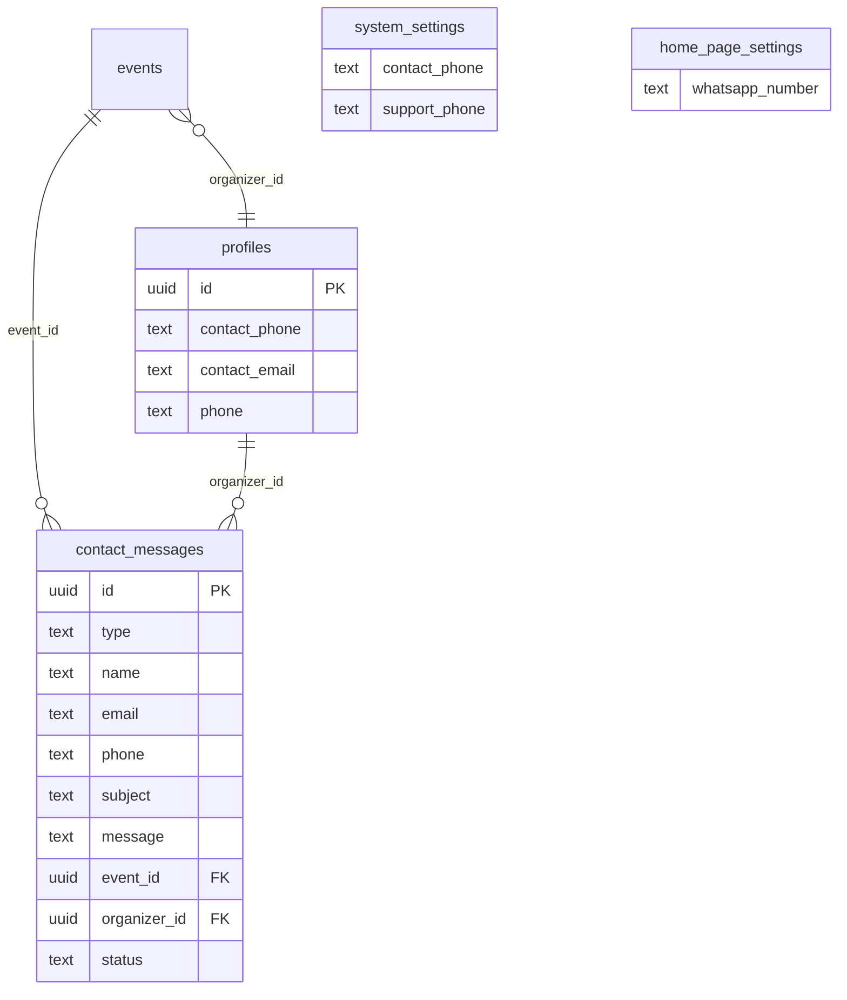

# AUDIT_EVENT_CONTACT_FLOW_TO_WHATSAPP

**Modo:** somente investigação (read-only)  
**Data:** 2026-06-03  
**Objetivo:** mapear o fluxo atual do botão **"Entrar em Contato"** na página pública do evento, antes de substituir (total ou parcialmente) o envio interno pela abertura direta do WhatsApp.

---

## Resumo executivo

O botão **"Entrar em Contato"** na página do evento abre o modal `ContactDialog`, que oferece **dois destinos**:

| Escolha do usuário | Destino lógico | Persistência | Notificação |
|---|---|---|---|
| **Dúvidas sobre o Evento** (`type: event`) | Organizador do evento | `contact_messages` + `organizer_id` derivado do evento | E-mail ao organizador |
| **Dúvidas sobre a Plataforma** (`type: platform`) | Admin / suporte da plataforma | `contact_messages` (sem `event_id`) | E-mail ao admin |

**Não existe tabela `leads`.** O “lead” de contato é a própria linha em `contact_messages`.

O telefone do organizador exibido na página (`organizer_contact_phone`) vem de `profiles.contact_phone`, mas o botão **não** abre WhatsApp — abre o formulário interno. O telefone só aparece como link `tel:` no card do organizador.

Para WhatsApp do site/admin existem **três fontes distintas** no sistema, com formatos heterogêneos e sem normalização centralizada.

**Recomendação:** estratégia **D** (WhatsApp do organizador para contato sobre evento; fallback para WhatsApp do admin) com opção **B** leve (registrar clique/intenção em `contact_messages` ou tabela de analytics) se quiser preservar métricas.

---

## ETAPA 1 — Frontend

### 1.1 Página pública do evento

| Item | Valor |
|---|---|
| **Arquivo** | `src/pages/EventDetails.tsx` |
| **Rotas** | `/evento/:slug` (principal), `/events/:id` (legado UUID) |
| **Registro de rota** | `src/App.tsx` ~L45–46 |

### 1.2 Botão "Entrar em Contato"

Existem **dois pontos** na mesma página:

| Local | Linhas aprox. | Ação |
|---|---|---|
| Card do organizador (sidebar) | ~1343–1350 | `onClick={() => setIsContactOpen(true)}` |
| Card "Dúvidas sobre o evento?" | ~1362–1370 | `onClick={() => setIsContactOpen(true)}` |

**Estado:** `isContactOpen` (`useState(false)`), linha ~171.

**Telefone do organizador (exibição separada):** linhas ~1319–1328 — link `tel:` com `organizer_contact_phone.replace(/[^\d]/g, '')`. Não abre o modal.

### 1.3 Modal / formulário

| Item | Valor |
|---|---|
| **Componente** | `src/components/event/ContactDialog.tsx` |
| **Montagem** | `EventDetails.tsx` ~1527–1534 |

**Props recebidas:**

```tsx
<ContactDialog
  open={isContactOpen}
  onOpenChange={setIsContactOpen}
  eventTitle={event?.title}
  organizerEmail={event?.organizer_contact_email}
  organizerName={event?.organizer_organization_name || event?.organizer_name}
  eventId={event?.id}
/>
```

**Observação:** `organizer_contact_phone` **não** é passado ao `ContactDialog` — o modal não usa o telefone do organizador hoje.

### 1.4 Estados do `ContactDialog`

| Estado | Tipo | Uso |
|---|---|---|
| `step` | `"select" \| "form"` | Passo 1: escolher tipo; passo 2: formulário |
| `contactType` | `"event" \| "platform" \| null` | Destino da mensagem |
| `isLoggedIn` | `boolean` | Usuário autenticado |
| `userProfile` | objeto perfil | Pré-preenchimento |
| `formFields` | `PublicFormFieldConfiguration[]` | Campos dinâmicos |
| `formData` | `Record<string, any>` | Valores do formulário |
| `isSubmitting` | `boolean` | Envio em andamento |
| `loadingFields` | `boolean` | Carregamento dos campos |

**Reset ao abrir:** `useEffect` quando `open === true` reseta step, contactType e recarrega campos (~L45–52).

### 1.5 Fluxo UX (passo a passo)



### 1.6 Campos do formulário (dinâmicos)

Carregados via `getPublicFormConfigurations("contact")` → `GET /api/form-configurations/public/contact`.

**Defaults no backend** (`formConfigurationsService.ts` ~L82–87):

| field_key | Obrigatório | Tipo |
|---|---|---|
| `name` | sim | text |
| `email` | sim | email |
| `phone` | não | tel |
| `subject` | sim | text |
| `message` | sim | textarea |

**Pré-preenchimento:**

- Logado: nome, e-mail e telefone do perfil (`getOwnProfile()`).
- Tipo `event`: assunto `Dúvida sobre: {eventTitle}`.
- Tipo `platform`: assunto `Dúvida sobre a plataforma`.

**Validação frontend:** campos `field_required` da config + checagem fixa de `name`, `email`, `subject`, `message` (~L224).

### 1.7 Payload enviado ao backend

**Função:** `handleSubmit` em `ContactDialog.tsx` ~L175–234  
**Cliente API:** `createContactMessage` em `src/lib/api/contactMessages.ts` ~L36–37

```json
{
  "type": "event | platform",
  "event_id": "uuid (somente se type=event)",
  "name": "string",
  "email": "string",
  "phone": "string (opcional)",
  "subject": "string",
  "message": "string"
}
```

`organizer_id` **não** é enviado pelo frontend — é resolvido no backend a partir do evento.

### 1.8 Endpoints chamados pelo frontend (fluxo de contato)

| Método | Endpoint | Auth | Arquivo cliente |
|---|---|---|---|
| GET | `/api/form-configurations/public/contact` | público | `src/lib/api/formConfigurations.ts` |
| GET | `/api/profiles/me` | autenticado (se logado) | `src/lib/api/profiles.ts` |
| POST | `/api/contact-messages` | público (`hasToken: false`) | `src/lib/api/contactMessages.ts` |

**Dados do evento (incl. contato do organizador):** carregados em `EventDetails` via `getEventById` → expõe `organizer_contact_email`, `organizer_contact_phone`, etc. (`src/lib/api/events.ts`).

---

## ETAPA 2 — Backend

### 2.1 Rotas HTTP

**Arquivo:** `backend/src/routes/contactMessages.ts`  
**Prefixo:** `/api/contact-messages` (registrado em `server.ts` ~L267)

| Método | Rota | Auth | Controller |
|---|---|---|---|
| POST | `/` | `optionalAuth` | `createContactMessageController` |
| GET | `/` | `authenticate` | `getContactMessagesController` |
| GET | `/new-count` | `authenticate` | `getNewContactMessagesCountController` |
| GET | `/:id` | `authenticate` | `getContactMessageByIdController` |
| PUT | `/:id` | `authenticate` | `updateContactMessageController` |

### 2.2 Controller — criação pública

**Arquivo:** `backend/src/controllers/contactMessagesController.ts`  
**Função:** `createContactMessageController` ~L36–123

**Schema Zod (obrigatórios):**

| Campo | Regra |
|---|---|
| `type` | `event` \| `platform` |
| `name` | min 3 |
| `email` | e-mail válido |
| `phone` | opcional |
| `subject` | min 3 |
| `message` | min 10 |
| `event_id` | UUID opcional |
| `organizer_id` | UUID opcional (ignorado do client para evento — sobrescrito) |

**Decisão organizador vs admin:**

```text
type === 'platform'  → mensagem para admin (sem event_id/organizer_id obrigatórios)
type === 'event'     → exige event_id válido; organizer_id = events.organizer_id
```

Implementação ~L50–62: `getEventById(event_id)` → `data.organizer_id = event.organizer_id`.

**Notificações pós-insert:**

| type | Destinatário | Função | Template |
|---|---|---|---|
| `platform` | Admin | `getAdminEmail()` | `new_contact_message_platform` |
| `event` | Organizador | `getOrganizerEmail(organizer_id)` | `new_contact_message_event` |

E-mails vêm de `notificationService.ts`:
- Admin: `support_email` → fallback `contact_email` (`system_settings`)
- Organizador: `profiles.contact_email` → fallback `users.email`

**Importante:** notificações são **somente e-mail**. Não há SMS/WhatsApp no fluxo de contato.

### 2.3 Service — persistência

**Arquivo:** `backend/src/services/contactMessagesService.ts`

**Função `createContactMessage` (~L38–69):**

```sql
INSERT INTO contact_messages (
  type, name, email, phone, subject, message, event_id, organizer_id
) VALUES (...)
```

Status inicial: default da coluna `status = 'new'`.

### 2.4 Listagem e permissões

**`getContactMessagesController` (~L129–178):**

| Papel | Filtro padrão |
|---|---|
| **Admin** | `type = 'platform'` (pode filtrar `type` via query) |
| **Organizador** | `type = 'event'` AND `organizer_id = req.user.id` |

**Contagem de novas mensagens (`/new-count`):**

| Papel | Query |
|---|---|
| Admin | `type='platform' AND status='new'` |
| Organizador | `type='event' AND organizer_id=$1 AND status='new'` |

### 2.5 Origem dos dados do organizador na API do evento

**Arquivo:** `backend/src/services/eventsService.ts` ~L514–518

```sql
p.contact_email as organizer_contact_email,
p.contact_phone as organizer_contact_phone,
```

JOIN `profiles p ON e.organizer_id = p.id`.

---

## ETAPA 3 — Banco de dados

### 3.1 Tabela `contact_messages`

**Migration:** `backend/migrations/052_create_contact_messages_table.sql`

| Coluna | Tipo | Observação |
|---|---|---|
| `id` | UUID PK | `gen_random_uuid()` |
| `type` | TEXT | CHECK: `event`, `platform` |
| `name` | TEXT NOT NULL | Nome do remetente |
| `email` | TEXT NOT NULL | E-mail do remetente |
| `phone` | TEXT | Opcional |
| `subject` | TEXT NOT NULL | Assunto |
| `message` | TEXT NOT NULL | Corpo |
| `event_id` | UUID | FK → `events(id)` ON DELETE SET NULL |
| `organizer_id` | UUID | FK → `profiles(id)` ON DELETE SET NULL |
| `status` | TEXT | CHECK: `new`, `viewed`, `replied`, `closed`; default `new` |
| `created_at` | TIMESTAMPTZ | default NOW() |
| `updated_at` | TIMESTAMPTZ | default NOW() |

**Índices:**

- `idx_contact_messages_type`
- `idx_contact_messages_status`
- `idx_contact_messages_event_id`
- `idx_contact_messages_organizer_id`
- `idx_contact_messages_created_at` (DESC)
- `idx_contact_messages_email`

**Uso atual:** inbox de contato admin/organizador, badges de notificação, e-mail transacional, migração de organizador (`changeEventOrganizerService` atualiza `organizer_id` por `event_id`).

### 3.2 Tabela `leads`

**Não existe** tabela `leads` no schema atual. O conceito de lead de contato está em `contact_messages`.

Tabelas com nome parecido (`group_leaders`, `organizer_group_leaders`, `leader_invitations`) são do módulo de líderes de grupo — **sem relação** com o fluxo de contato do evento.

### 3.3 Tabela auxiliar `form_configurations`

**Migration:** `053_create_form_configurations_table.sql`

Armazena campos dinâmicos dos formulários `quote` e `contact`. Índices por `form_type`, `field_order`, `field_enabled`.

Admin edita em `src/components/admin/FormConfigurations.tsx` (aba **Contato**).

### 3.4 Tabela relacionada `quotes` (orçamentos — fluxo separado)

**Migration:** `051_create_quotes_table.sql`

Formulário público de orçamento (`/orcamento` → `Quote.tsx`). **Não** faz parte do botão "Entrar em Contato" do evento, mas compartilha padrão de inbox admin (`QuotesManagement`) e configuração de formulário.

---

## ETAPA 4 — Origem do telefone

### 4.1 Organizador

| Fonte | Tabela/coluna | Uso |
|---|---|---|
| **Telefone de contato da organização** | `profiles.contact_phone` | Exibido na página do evento; editável em Configurações do organizador |
| **Telefone pessoal do perfil** | `profiles.phone` | Obrigatório no cadastro; usado em inscrições/perfil; **não** usado no card do evento |

**Migration:** `012_organizer_settings.sql` adiciona `contact_email` e `contact_phone` em `profiles`.

**Edição UI:** `src/components/organizer/OrganizerSettings.tsx` ~L308–316  
**API:** `backend/src/controllers/organizerController.ts` — validação `contact_phone: z.string().optional()`

**Formato persistido:** texto livre. Placeholder UI: `(00) 00000-0000`. **Sem máscara obrigatória nem normalização no backend.**

**Exibição na página do evento:** valor formatado como digitado; link `tel:` remove não-dígitos no frontend apenas.

### 4.2 Admin / plataforma

| Fonte | Tabela/coluna | Uso atual |
|---|---|---|
| Telefone geral | `system_settings.contact_phone` | Configurações do sistema (`SystemSettings.tsx`) |
| Telefone suporte | `system_settings.support_phone` | Configurações do sistema |
| WhatsApp homepage | `home_page_settings.whatsapp_number` | Exibido na home (`Index.tsx`); editável em `HomeCustomization.tsx` |
| Texto WhatsApp homepage | `home_page_settings.whatsapp_text` | Texto exibido abaixo do número |

**E-mails (não telefone) usados nas notificações de contato:**

- Admin: `support_email` → `contact_email`
- Organizador: `profiles.contact_email` → `users.email`

**Gap:** `contact_phone`, `support_phone` e `whatsapp_number` **não participam** do fluxo de contato do evento hoje. O número da homepage **não é link clicável** — apenas texto exibido (~`Index.tsx` L290–293).

**Defaults:**

- `home_page_settings.whatsapp_number`: `+5511999999999`
- `Index.tsx` fallback local: `"85 99108-4183"`

### 4.3 Normalização existente no código

| Local | Comportamento |
|---|---|
| `EventDetails.tsx` link `tel:` | `replace(/[^\d]/g, '')` |
| Formulário de orçamento (quote) | placeholder sugere “somente números” |
| Backend contact/organizer | nenhuma normalização |

**Não há** utilitário compartilhado `formatWhatsAppNumber` / DDI 55 no projeto.

---

## ETAPA 5 — Inventário de consumidores

### 5.1 `contact_messages` e APIs relacionadas

| Tela / componente | Rota / contexto | Funções usadas | Necessidade pós-WhatsApp |
|---|---|---|---|
| `ContactDialog.tsx` | Página do evento | `createContactMessage` | **Substituível** se migrar 100% para WhatsApp |
| `ContactMessagesManagement.tsx` | Admin → Suporte → aba Contatos | list/get/update | **Obsoleta parcial** se não houver mais POST |
| `OrganizerContactMessages.tsx` | Organizador → Mensagens | list/get/update | **Obsoleta parcial** |
| `CommunicationSupport.tsx` | `/admin/suporte` | badge + aba contatos | Badge depende de `new-count` |
| `AdminSidebar.tsx` | Menu Suporte | `getNewContactMessagesCount` | Badge agregado com documentos |
| `OrganizerSidebar.tsx` | Menu Mensagens | `getNewContactMessagesCount` | Badge no menu |
| `FormConfigurations.tsx` | Admin config formulário contato | `form_configurations` contact | **Obsoleta** se formulário removido |
| `notificationTemplatesService` | Sistema | `new_contact_message_*` | **Obsoleta** se não houver insert |
| `changeEventOrganizerService` | Migração organizador | UPDATE `contact_messages` | **Ainda necessária** se histórico mantido |

### 5.2 Fluxos adjacentes (não são `contact_messages`)

| Item | Relação |
|---|---|
| `quotes` / `QuotesManagement` | Orçamentos — inbox separado |
| `Index.tsx` seção WhatsApp | Marketing homepage — número em `home_page_settings` |
| `FAQ.tsx` seção contato | Conteúdo estático |
| Card organizador `tel:` / `mailto:` | Links diretos, paralelos ao modal |

### 5.3 Eventos customizados no frontend

| Evento | Disparado por | Ouvintes |
|---|---|---|
| `contact-messages-updated` | Após criar/atualizar mensagem | `AdminSidebar`, `OrganizerSidebar`, `CommunicationSupport` |

---

## ETAPA 6 — Estratégias possíveis

### A — Substituir completamente pelo WhatsApp

**Prós:** UX imediata; sem manutenção de formulário/inbox.  
**Contras:** perda total de histórico estruturado, badges, relatórios e e-mails automáticos; organizadores sem telefone ficam sem canal.

### B — Abrir WhatsApp e também registrar lead na plataforma

**Prós:** melhor dos dois mundos — conversa no WhatsApp + métricas/CRM.  
**Contras:** mensagem pré-preenchida pode divergir do que o usuário envia; duplicidade conceitual (lead “sintético”).

### C — WhatsApp quando existir telefone; fallback formulário atual

**Prós:** rollout seguro; cobre organizadores sem WhatsApp.  
**Contras:** duas UX paralelas; mais lógica condicional.

### D — Organizador no WhatsApp; sem telefone válido → WhatsApp do admin

**Prós:** alinhado ao pedido de negócio; sempre há destino.  
**Contras:** admin pode receber dúvidas que seriam do organizador; precisa regra clara na UI.

### Comparativo rápido

| Critério | A | B | C | D |
|---|---|---|---|---|
| Preserva inbox | Não | Parcial | Parcial | Parcial/Não |
| Funciona sem tel. org. | Não | Sim* | Sim | Sim |
| Esforço | Baixo | Médio | Médio | Médio |
| Risco operacional | Alto | Baixo | Baixo | Baixo |

\*Com registro sintético ou fallback.

---

## ETAPA 7 — WhatsApp (formato técnico)

### 7.1 URLs suportadas

| Formato | Uso |
|---|---|
| `https://wa.me/{numero}` | Recomendado — número **somente dígitos**, com DDI |
| `https://api.whatsapp.com/send?phone={numero}&text={encoded}` | Equivalente com mensagem pré-preenchida |

`wa.me` também aceita query `?text=` para mensagem inicial.

### 7.2 Regras para Brasil

1. Remover máscara: `(85) 99108-4183` → `85991084183`
2. Se 10 ou 11 dígitos (DDD + número), prefixar `55`
3. Resultado esperado: `5585991084183` (13 dígitos típico para celular)

**Exemplo de implementação futura (não existe hoje):**

```ts
function toWhatsAppDigits(raw: string, defaultCountry = '55'): string | null {
  const digits = raw.replace(/\D/g, '');
  if (digits.length < 10) return null;
  if (digits.length <= 11) return defaultCountry + digits;
  if (digits.startsWith('55')) return digits;
  return digits; // já com DDI
}
```

### 7.3 Compatibilidade com dados atuais

| Fonte | Exemplo | Pronto para wa.me? |
|---|---|---|
| `profiles.contact_phone` | `(85) 99108-4183` | Após normalização |
| `system_settings.contact_phone` | variável | Após normalização |
| `home_page_settings.whatsapp_number` | `+5511999999999` ou `85 99108-4183` | Formato misto — normalizar |

### 7.4 Mensagem pré-preenchida (URL encoding)

Caracteres especiais, quebras de linha e acentos devem usar `encodeURIComponent`.

---

## ETAPA 8 — Experiência desejada (mapeamento)

### 8.1 Fluxo alvo



### 8.2 Conteúdo sugerido da mensagem

```
Olá! Tenho interesse no evento {nome do evento} e gostaria de mais informações.

Evento: {título}
Data: {data formatada}
Local: {cidade}/{estado}
Organizador: {nome}
Link: {url da página}
```

**Dados já disponíveis em `EventDetails`:** `title`, `event_date`, `city`, `state`, `organizer_name` / `organizer_organization_name`, slug para montar URL (`/evento/{slug}`).

### 8.3 Comportamento do botão hoje vs desejado

| Aspecto | Hoje | Desejado |
|---|---|---|
| Clique | Abre modal 2 passos + formulário | Abre WhatsApp direto (ou após escolha evento/plataforma) |
| Destino evento | E-mail organizador + DB | Número `profiles.contact_phone` |
| Destino plataforma | E-mail admin + DB | `home_page_settings.whatsapp_number` ou `system_settings.support_phone` |
| Mensagem | Digitada pelo usuário no form | Template pré-preenchido editável no WhatsApp |

### 8.4 Escolha evento vs plataforma

O modal atual **força** essa decisão antes do formulário. Para WhatsApp:

- **Opção 1:** manter seleção (dois botões → dois números diferentes).
- **Opção 2:** na página do evento, assumir sempre contato sobre **evento** (organizador); link para plataforma ficaria na home/rodapé.

---

## ETAPA 9 — Riscos

| Risco | Impacto | Mitigação sugerida |
|---|---|---|
| Organizador sem `contact_phone` | Botão sem destino | Fallback admin (D) ou manter formulário (C) |
| Telefone inválido / fixo sem WhatsApp | Link abre conversa errada | Validação mínima (10–13 dígitos); hint na config do organizador |
| Admin sem telefone configurado | Fallback plataforma falha | Prioridade: `whatsapp_number` → `support_phone` → `contact_phone`; alerta no admin |
| Perda de histórico em `contact_messages` | Sem inbox e badges | Estratégia B ou manter POST “lead de clique” |
| Impacto no contador de mensagens | Badges zerados ou estáticos | Novo evento de analytics ou descontinuar badges |
| Formulário configurável (`form_configurations`) | Investimento admin perdido | Deprecar aba contato com aviso |
| Notificações e-mail | Organizador deixa de receber e-mail automático | Aceitável se WhatsApp for canal principal |
| Privacidade / LGPD | Abrir WhatsApp expõe número do organizador | Já exposto no card `tel:` — mesmo nível |
| Desktop sem WhatsApp | `wa.me` abre WhatsApp Web ou store | Comportamento padrão aceitável |
| Migração de organizador | Histórico `contact_messages` amarrado a `organizer_id` | Manter tabela mesmo em modo WhatsApp-only |

---

## Entregáveis

### 1. Cadeia completa do fluxo atual

```text
EventDetails (botão)
  → setIsContactOpen(true)
  → ContactDialog
      → [select] contactType event|platform
      → GET /api/form-configurations/public/contact
      → [form] handleSubmit
      → POST /api/contact-messages
          → contactMessagesController.createContactMessageController
              → getEventById (se type=event) → organizer_id
              → contactMessagesService.createContactMessage → INSERT contact_messages
              → sendNotificationSafely (email admin ou organizador)
          → resposta JSON success
  → toast + contact-messages-updated
  → AdminSidebar / OrganizerSidebar atualizam badge via GET /new-count
```

### 2. Inventário de arquivos

| Camada | Arquivo |
|---|---|
| Página evento | `src/pages/EventDetails.tsx` |
| Modal contato | `src/components/event/ContactDialog.tsx` |
| API cliente | `src/lib/api/contactMessages.ts` |
| API formulário | `src/lib/api/formConfigurations.ts` |
| API evento | `src/lib/api/events.ts` |
| Rotas | `backend/src/routes/contactMessages.ts` |
| Controller | `backend/src/controllers/contactMessagesController.ts` |
| Service | `backend/src/services/contactMessagesService.ts` |
| Evento SQL | `backend/src/services/eventsService.ts` |
| Form defaults | `backend/src/services/formConfigurationsService.ts` |
| Notificações | `backend/src/services/notificationService.ts` |
| Templates | `backend/src/services/notificationTemplatesService.ts` |
| Admin inbox | `src/components/admin/ContactMessagesManagement.tsx` |
| Organizador inbox | `src/components/organizer/OrganizerContactMessages.tsx` |
| Config tel. org. | `src/components/organizer/OrganizerSettings.tsx` |
| Config tel. admin | `src/components/admin/SystemSettings.tsx` |
| WhatsApp home | `src/components/admin/HomeCustomization.tsx`, `src/pages/Index.tsx` |
| Migrations | `052_create_contact_messages_table.sql`, `053_create_form_configurations_table.sql`, `012_organizer_settings.sql` |

### 3. Tabelas envolvidas

| Tabela | Papel |
|---|---|
| `contact_messages` | Persistência do lead/mensagem |
| `form_configurations` | Campos do formulário de contato |
| `events` | `event_id`, `organizer_id` |
| `profiles` | `contact_phone`, `contact_email`, `organization_name` |
| `users` | fallback e-mail organizador |
| `system_settings` | telefones/e-mails admin |
| `home_page_settings` | WhatsApp marketing da homepage |

### 4. Origem dos números de WhatsApp (recomendação)

| Cenário | Fonte primária | Fallback |
|---|---|---|
| Contato sobre **evento** | `profiles.contact_phone` (organizador do evento) | `home_page_settings.whatsapp_number` ou `system_settings.support_phone` |
| Contato sobre **plataforma** | `home_page_settings.whatsapp_number` | `system_settings.support_phone` → `contact_phone` |

**Não usar** `profiles.phone` do organizador como padrão — é telefone de cadastro pessoal, não necessariamente WhatsApp comercial.

### 5. Impacto da mudança

| Área | Impacto |
|---|---|
| UX página evento | Alto — substitui modal por deep link |
| Backend POST contact-messages | Pode ser descontinuado ou mantido só em B |
| Badges admin/organizador | Reduzem utilidade sem insert |
| E-mails transacionais | Deixam de disparar no fluxo principal |
| `FormConfigurations` contact | Torna-se legado |
| Card `tel:` do organizador | Pode redundar com botão WhatsApp |
| Migração organizador | `contact_messages` histórico permanece relevante se B |

### 6. Recomendação de arquitetura

**Adotar estratégia D + elementos de B:**

1. **Na página do evento**, o botão **"Entrar em Contato"** abre WhatsApp do organizador (`profiles.contact_phone`) com mensagem pré-preenchida contendo título, data, cidade/UF, organizador e link do evento.
2. **Se telefone do organizador ausente/inválido**, usar WhatsApp global (`home_page_settings.whatsapp_number` normalizado, com fallback em `system_settings`).
3. **Manter opcionalmente** um POST leve (`type: event`, `message: "[clique WhatsApp]"`, dados mínimos) para analytics e badge — ou substituir badges por outra métrica.
4. **Criar utilitário único** `buildWhatsAppUrl(phone, text)` no frontend (e opcionalmente endpoint público que retorna número resolvido + URL, se quiser esconder lógica de fallback).
5. **Passar `organizer_contact_phone`** (e eventualmente telefone admin) para o componente de contato ou resolver tudo em `EventDetails` antes do redirect.
6. **Deprecar gradualmente** o passo "Dúvidas sobre a Plataforma" **dentro** da página do evento — esse fluxo pertence à home/rodapé; na página do evento, contato deve ser sobre o evento.
7. **Config do organizador:** reforçar que "Telefone de Contato" deve ser WhatsApp com DDD; validação soft no save.

**Escopo mínimo de implementação (quando autorizado):**

- `EventDetails.tsx` + novo helper WhatsApp
- Opcional: `ContactDialog.tsx` simplificado ou removido
- Sem mudança de schema se estratégia A pura; com B, reutilizar `contact_messages` existente

---

## Apêndice — Diagrama de dados



---

*Documento gerado por auditoria read-only. Nenhuma alteração de código foi aplicada.*
